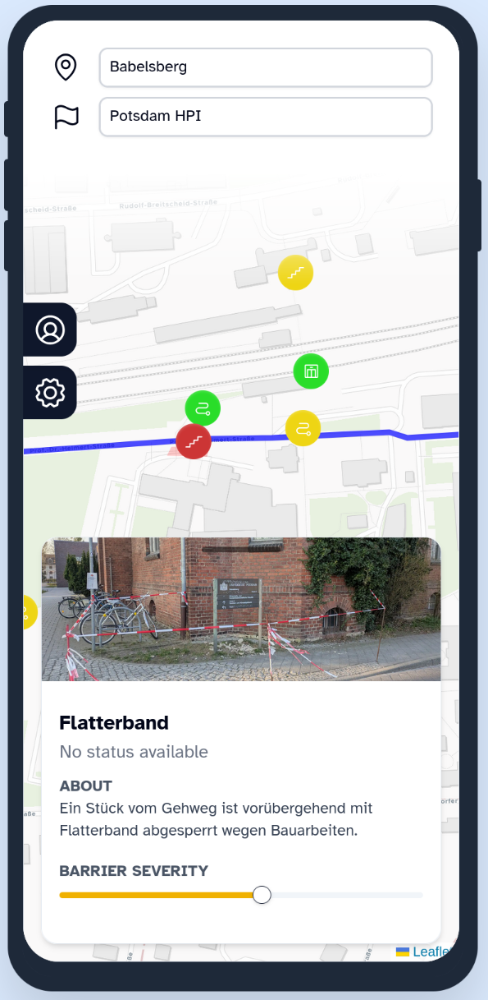
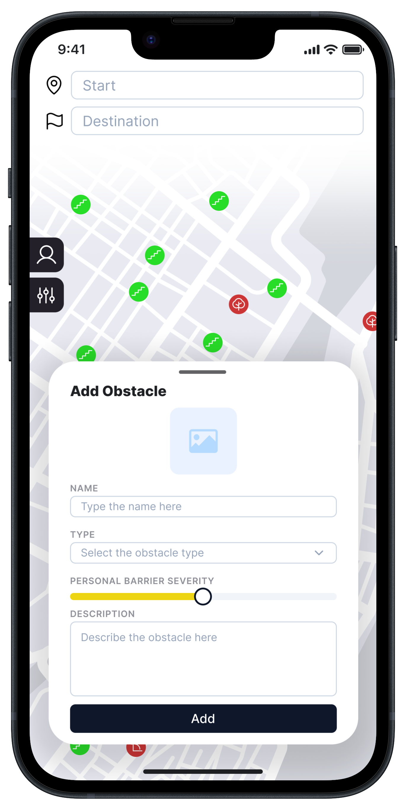
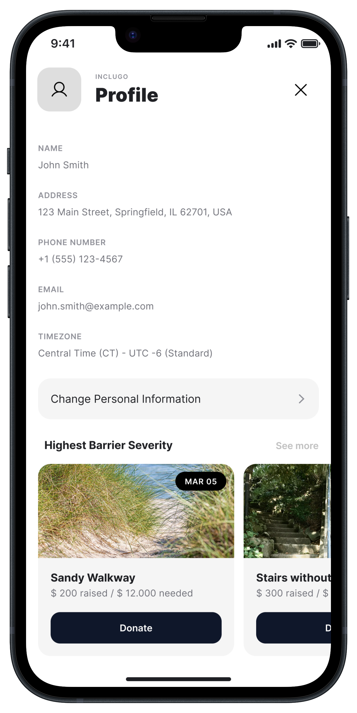
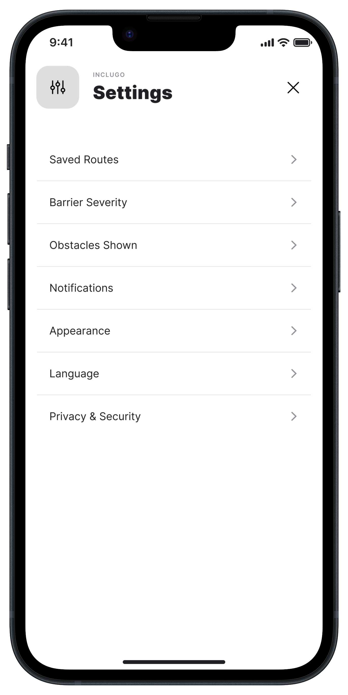

# IncluGO 🚶‍♂️
**Your journey. Your way.**

Whether you use a wheelchair, a prosthetic, have visual impairments, 
or prefer to avoid crowded spaces — we prioritize accessibility for you.
Because **every disability is unique** to you.

Wo don't event want to put you in Boxes. The help you personalize the experience, you just give some hints about what is an obstacle in **your live**.
Simply swipe right for situations that are a problem to you. 

/video vom swipen/

We will offer you a route specialised for you. Before you go, you can **preview the route** so there are **no more surprises** on the way.
Change the route as you wish, the app will **learn from you and all other users** so the route will be good on the first try. 

  

## What we plan to implement 🔮
- Adding obstacles with a **personalised barrier severity**
- A **profile and settings tab**
- A **funding feature** to get rid of the obstacles in the future
- A separate **web interface** for public facilities to see which obstacles have the highest overall barrier severity and should be fixed as soon as possible

<table>
  <tr>
    <td></td>
    <td></td>
    <td></td>
    <td></td>
  </tr>
</table>
