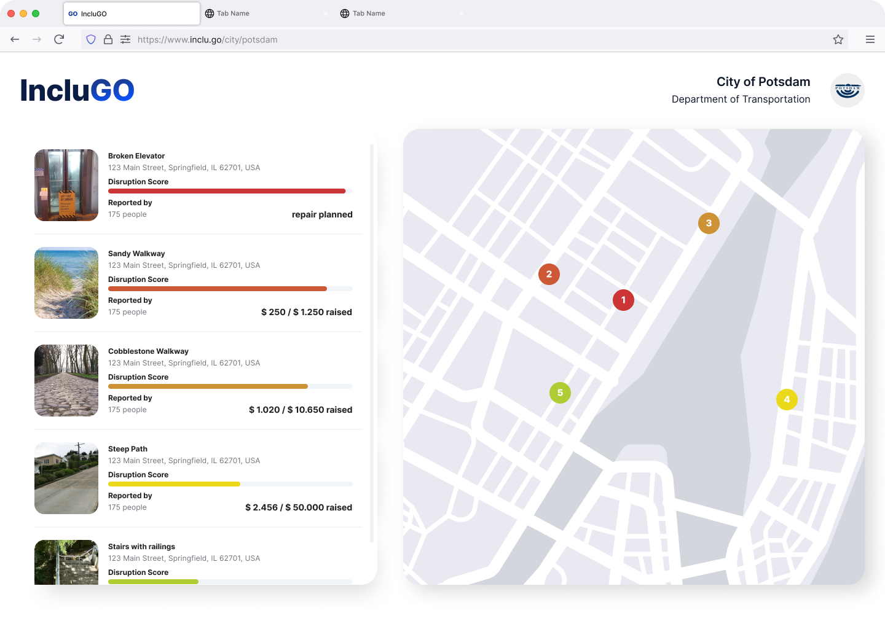

# IncluGO 🚶‍♂️
**Your journey. Your way.**

Whether you use a wheelchair, a prosthetic, have visual impairments, 
or prefer to avoid crowded spaces we prioritize accessibility for you –
because **every disability is unique**. 
While wheelchair-users have to avoid stairs, people with mental disabilities might want to avoid crowded areas.

There is so much diversity, that wo don't even want to put you in boxes by your diagnosis. To help you personalize the experience, you just give some hints about what is an obstacle in **your live**.
Simply swipe right for situations that are a problem to you. 

We will offer you a route specialised for you. Before you go, you can **preview the route** so there are **no more surprises** on the way.
Change the route as you wish, the app will **learn from you and all other users** so the route will be good on the first try. 

All of this is **fully functional** and implemented in a React app.

  

The personalised approach has multiple further benefits:
 - Users can add further obstacles adding to the **Open Dataset** of Open Street Map. Other apps are free to use the data for the greater good.
 - The city can see problems which **affect real people** – and fund them accordingly.
 - People **benefit of the experiences of everybody** to get a personalised experience.
 - No more anxiety before starting a journey, see everything before leaving your safe space.

<table>
  <tr>
    <td></td>
    <td></td>
    <td></td>
    <td></td>
  </tr>
</table>
